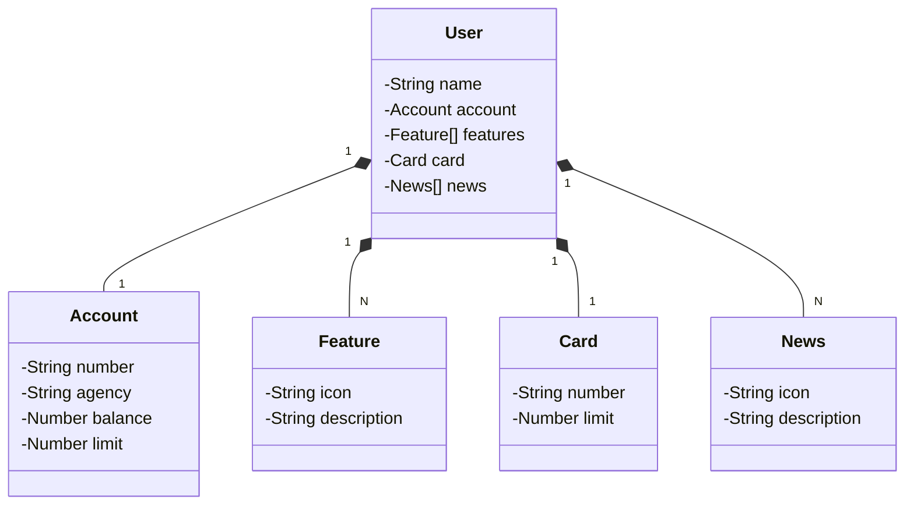

# Java RESTful API
Projeto desenvolvido durante o Santander Bootcamp 2024.

## Tecnologias Utilizadas
- **Java 17**: Versão da linguagem Java utilizada para desenvolver o projeto.
- **Spring Boot 3**: Framework que facilita a criação de aplicações Spring, permitindo desenvolvimento rápido e menos configuração.
- **Spring Data JPA**: Framework para simplificar a implementação de repositórios baseados em JPA.
- **H2 Database**: Banco de dados em memória utilizado para testes locais.
- **PostgreSQL**: Banco de dados relacional utilizado no deploy.
- **Render**: Plataforma utilizada para deploy da aplicação na nuvem.
- **OpenAPI Swagger**: Ferramenta utilizada para testar a API, proporcionando uma interface interativa para explorar os endpoints disponíveis.

## Diagrama de Classes

